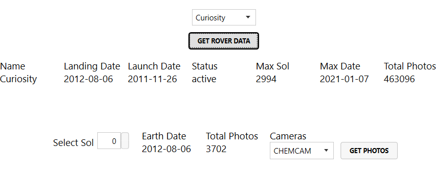

# Introduction

Mars Rover is a WPF PRISM application that allows the user to view photos taken by the Curiosity, Opportunity, and Spirit rovers. It makes use of the public API NASA makes available (see https://api.nasa.gov/).

## Set up

Before attempting to run the application, you need to have a key - go the the site listed above, fill in your details and NASA will email you it. Once you have the key, open the MarsRover.sln in Visual Studio 2019 and open the App.config file in the main MarsRover project. You will see an appsettings section:

```xml 
<appSettings>
    <add key="ApiKey" value="insert api key here"/>
    <add key="ApiBaseUrl" value="https://api.nasa.gov/mars-photos/api/v1"/>
</appSettings>
```

Replace the 'insert api key here' text with your key.

## Running

Build and run the app - you will be presented with a screen


The dropdown allows you to select from different Rovers - press the Get Rover Data button and further information will be displayed:



From here you can cycle through through the Sol days that the pictures were taken on as well as selected different cameras from the drop down. Pressing Get Photos will retrieve the photos taken on that day for that camera:


## Contributing
Pull requests are welcome. 

## License
[MIT](https://choosealicense.com/licenses/mit/)
